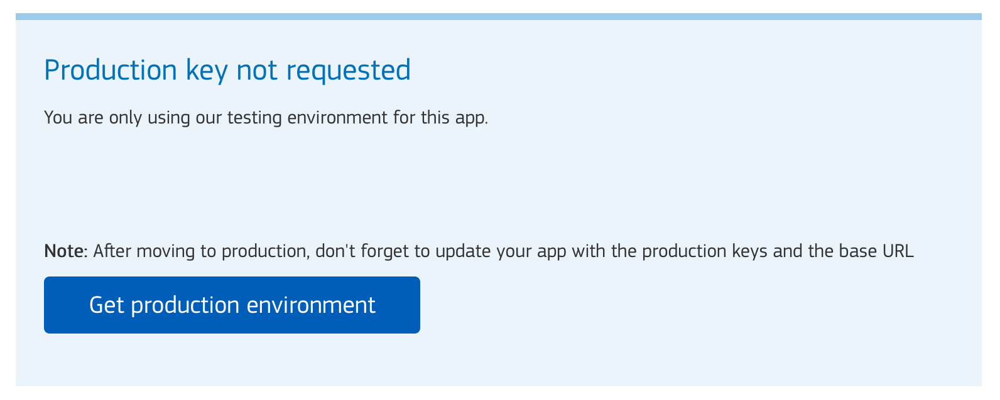
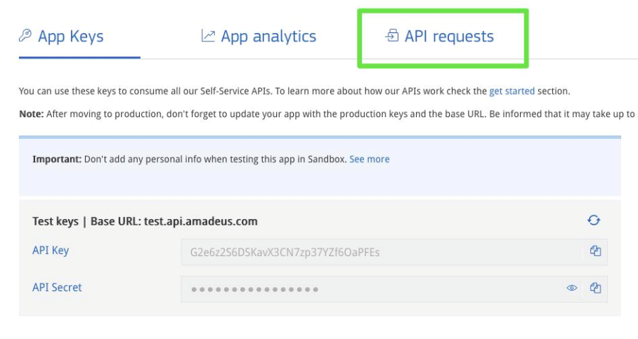
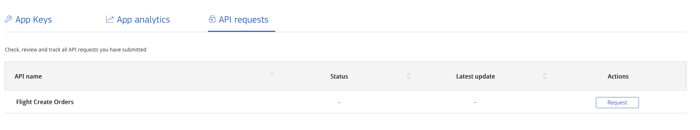

# Moving to production

Once you feel that your application is ready to be deployed to the Real World™,
you might want to move it to Production Environment.

## Requesting the production keys

Moving your application to Production Environment means requesting a
**production key**, but don't be scared! The process is very straight forward:

1. [Sign in](https://developers.amadeus.com/login) to your account
2. Click on your username \(top right corner\)
3. Go to [My Self-Service Workspace](https://developers.amadeus.com/my-apps)
4. Select the application that you want to move to Production and click on `Get Production environment` button:



Moving to **production environment** involves 3 steps:

1. Add your personal and billing information. Fill in the form with your
   personal details, billing address and app information. Select `Yes` if your
   application uses `Flight Create Orders API`. Please refer to the `Moving to
   Production with Flight Create Orders API` section of this guide to
   understand the requirements needed.
2. Method of Payment. Select your preferred method of payment  \(credit card or
   bank transfer\) and add the necessary details.
3. Sign a Terms of Service agreement. Sign the provided Terms of Service
   contract on `Docusign`. 


At this point your application's status will show **pending**:


Once your application is validated you will be notified and the application's
status will change to **live**:


> Please note that the process can take up to 72 hours for your first application. Additional applications will **not** require any waiting time.

Be aware that these keys are valid for all Self-Service APIs but are not valid
for `Flight Create Orders API`. We will contact you within a few days to assure
that all requirements are met and assist you in meeting any pending
requirements.

Remember that once you reach the threshold of free transactions, you will
automatically be billed for each transaction on a monthly basis. You can
easily manage and track your app usage on [My Self-Service
Workspace](https://developers.amadeus.com/my-apps).

## Using the new production keys

Once you get your production key, you will need to change your source code:

- Replace the base URL for your API calls to point to `https://api.amadeus.com`
instead of `https://test.api.amadeus.com`
- Change your `API key` and `API secret` with your new production keys.

If you are using our [SDKs](https://github.com/amadeus4dev), just initialise the client as follows:

    ``` python
    amadeus = Client(client_id='YOUR_PRODUCTION_CLIENT_ID',
                 client_secret='YOUR_PRODUCTION_CLIENT_SECRET',
                 hostname='production')
    ```

## Moving to production with Flight Create Orders API

There are some special APIs that require aditional steps when moving your
application to production. As of today, there is only one: `Flight Create
Orders`, which belongs to the Flight booking flow.

Before requesting a production key an application using `Flight Create Order`,
you must take into consideration some requirements.

### Requirements

1. You are not IATA /ARC registered travel agency. Self-Service flight
   bookings are designed for businesses without travel agency certification. If
   you have IATA or ARC certification and want to access our REST/JSON booking
   APIs, contact us and we’ll put you in touch with our Enterprise APIs team. 

2. You have a ticket issuance agreement with a consolidator. Only certified
   travel agents can issue flight tickets. Non-certified businesses must issue
   tickets via an airline consolidator (an entity that acts as a host agency
   for non-certified agents). Contact us for help finding the right
   consolidator for you. 

3. Self-Service bookings are allowed in your country – Unfortunately,
   Self-Service flight booking is still not available to companies in the
   following countries: 

Algeria, Bangladesh, Bhutan, Bulgaria, Croatia, Egypt, Finland, Iceland, India,
Iran, Iraq, Jordan, Kuwait, Kosovo, Lebanon, Libya, Madagascar, Maldives,
Montenegro, Morocco, Nepal, Pakistan, Palestine, Qatar, Saudi Arabia, Serbia,
South Korea, Sri Lanka, Sudan, Syria, Tahiti, Tunisia, United Arab Emirates and
Yemen 

4. You comply with local regulations . Flight booking is also subject to local
   regulations and many areas (notably California and France) have special
   requirements.

If you meet the above requirements, you are ready to move your application 
to production.

###  Adding flight booking to a production app

To add flight booking capabilities to an app currently in production, just
select the app in the My Apps section of your Self-Service Workspace and click
on API requests:



You can then request production access to Flight Create Orders by clicking on
the Request button, located under Actions:




